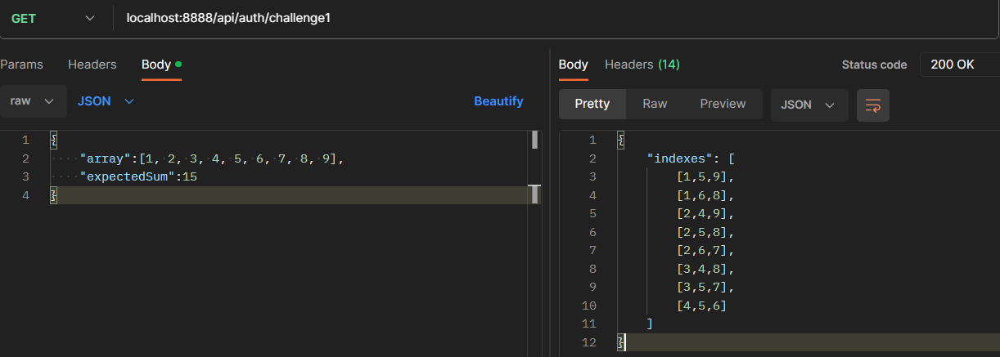
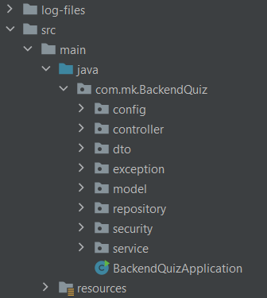
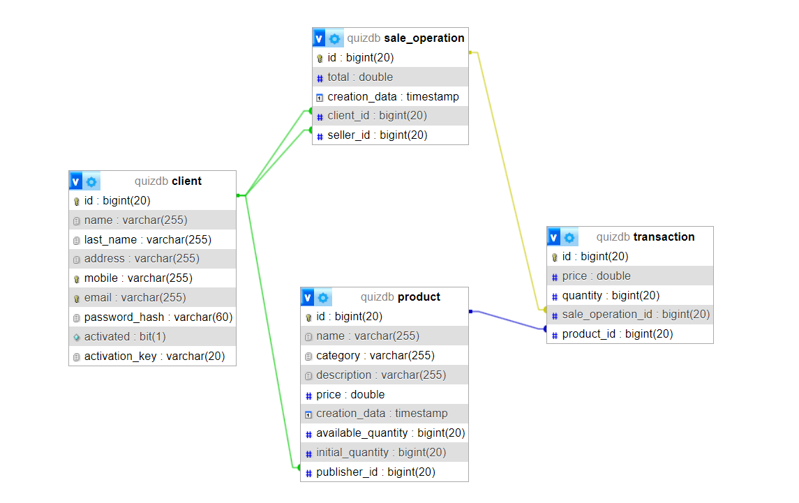

# BackendQuiz

### Welcome to the BackendQuiz repository! This is a quiz application's backend built using Spring Boot for handling the server-side logic.

# Challenge 1

You can find challenge 1 in :

```
master/src/main/java/com/mk/BackendQuiz/controller/AuthController.java
```

And can test it by using this endpoint :

```
localhost:8888/api/auth/challenge1
```

This is an example :



---------------------------

# Challenge 2

## Project Architecture



### log-files

        For logging important system activities.

### config

    It contains :
        1 - LiquibaseConfig  : i use it to add fake data to database to facilitate the testing process
        2 - PropertiesConfig : to use application.properties in the project
        3 - QuizConfig       : to important config Helps speed up work.
        4 - SecurityConfig   : to security matters like Authentication & Authorization ..

### controller

    It contains a Auth, Client, Product and SaleOperation RestApi and endpoints.

### dto

    It contains all data transfer objects used in requests and response.

### exception

    It contains the layer that receives exceptions using ControllerAdvice.

### model

    It contains Client, Product, SaleOperation and Transactions entities and the relationships between them.

### repository

    The layer for interacting with databases (Mysql in this project).

### security

    It contains JWT  configrations which is a authentication mechanism for REST APIs.

### service

    Service layer where all the system's processors take place.

### resources

    Contains liqibase xml files and fake data represnted with csv files.
    And important application properties like database connection ...etc
    And handling excpetion messages.
    And logging xml config.

### Don't forget to download the postman collection and try the app yourself.

#### You will find all possible cases and for each case there is an example

```
BackendQuiz.postman_collection.json
```

# Database Schema

The current schema looks as follows:


